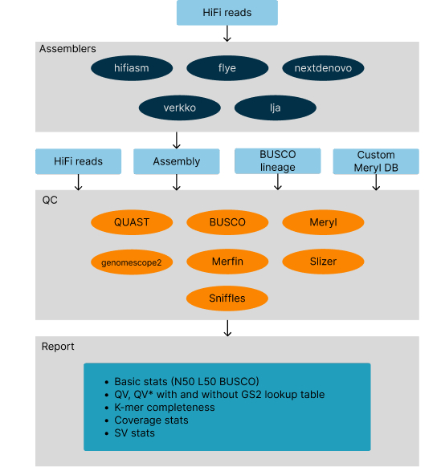

## hifiblender: A Snakemake Pipeline for HiFi Genome Assembly and Quality Control

**hifiblender** is a versatile Snakemake pipeline designed for efficient genome assembly using HiFi reads and comprehensive quality control (QC) assessments. 

### Pipeline structure



### Key Features

* **Flexible Assembly:** Supports various state-of-the-art assemblers, including hifiasm, hifiasm-hic, flye, canu, lja, verkko, verkko-hic, and nextdenovo, allowing you to choose the best tool for your specific data and project.
* **Integrated QC:** Provides a comprehensive suite of QC metrics to evaluate the quality and completeness of your assembly, including QUAST reports, BUSCO scores, QV/QV*/K* completeness estimates, coverage analysis, and structural variant detection. 
* **Easy Setup:** Requires only a Snakemake environment for operation, making it simple to get started with minimal configuration. 
* **Automatic Tool Installation:** hifiblender automatically installs all necessary tools within the designated environment, streamlining the process and ensuring you have the required software.
* **Customizable Runs:**  Allows for parameter adjustments and customization through rule code modification to tailor the pipeline to your specific needs and preferences.
* **Multiple Run Modes:** Offers various run modes, including assembly, QC, and hybrid approaches, allowing you to perform assembly, QC, or both depending on your requirements.
* **Preserved Intermediate Files:** Outputs from all tools are retained in the output directory, organized by tool name, enabling further downstream analyses and investigations. 

### Installation

To set up the required Snakemake environment, use the following command:

```bash
mamba create -n snakemake -c bioconda -c conda-forge -c defaults snakemake && conda activate snakemake
```

### Running hifiblender
The pipeline offers various modes and options for assembly and QC. Here are some examples:
**Assembly Modes:**
- Assemble with hifiasm and perform SV analysis:
`bash hifiblender.py -a hifiasm -f reads.fastq -o output_dir -sv`
- Assemble with hifiasm-hic, calculate coverage, and identify SVs:
`bash hifiblender.py -a hifiasm_hic -f reads.fastq -1 forward_hic.fastq -2 reverse_hic.fastq -o output_dir -c -sv`
**QC Mode:**
- Perform QC on an existing assembly with QV analysis:
`bash hifiblender.py --assembly my_assembly.fasta -o output_dir -f reads.fastq -k 21`
### Options:
`-a/--assembler`: Choose the assembler (hifiasm, hifiasm_hic, flye, canu, lja, verkko, verkko_hic, nextdenovo). Default is hifiasm.
`-f/--fastq`: Path to HiFi reads in FASTQ format.
`-1/--forward_hic_read`: Path to forward Hi-C read file (for Hi-C based assembly).
`-2/--reverse_hic_read`: Path to reverse Hi-C read file (for Hi-C based assembly).
`--assembly`: Path to an existing assembly for QC analysis.
`-o/--outdir`: Output directory.
`-t/--threads`: Number of threads to use. Default is 8.
`-sv/--sv_analysis`: Perform structural variant analysis with Sniffles.
`-c/--coverage`: Calculate coverage and generate reports with SLiZer.
`-k`: K-mer size for QV analysis with Meryl. Default is 21.
### Output:
hifiblender generates the assembled genome (in assembly modes) and various QC metrics in the specified output directory.
Intermediate files from each tool are preserved and organized by tool name for further analysis.
### Tools Used
hifiblender utilizes various bioinformatics tools, including:
- Assemblers: hifiasm, flye, canu, lja, verkko, nextdenovo
- QC Tools: QUAST, BUSCO, Meryl, SLiZer, Sniffles, Merfin, GenomeScope
- Alignment: minimap2
- Other: samtools, bcftools, seqtk

**We welcome contributions and feedback to further improve hifiblender!**